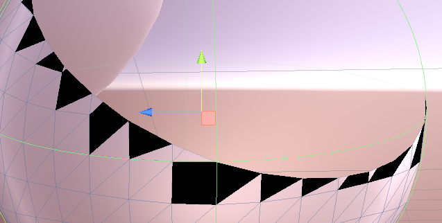

# Unity Mesh Manipulation Test

This is a repository for testing unity Mesh features. It includes the direct access to vertices, normals, uvs and triangles.

# Current Update

* Keep the triangle where all the vertices are below the plane
  * If only one vertex is below the plane,
    * move other two vertices onto the plane
    * If either or both of two vertices has already been moved toward another point, create new point(s) and a new triangle
  * If two vertices are below the plane,
    * try to move the last above point toward the two points
    * if it is already moved to other direction, create a new point
    * move one triangle and create one triangle

Black triangles are newly created ones.

