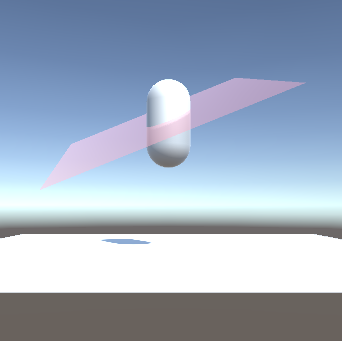
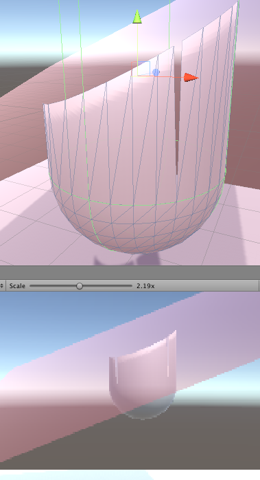

# Unity Mesh Manipulation Test

This is a repository for testing unity Mesh features. It includes the direct access to vertices, normals, uvs and triangles.

# Current Update

* Keep the triangle where all the vertices are below the plane
* If only one vertices are below the plane, move other two vertices onto the plane

 
